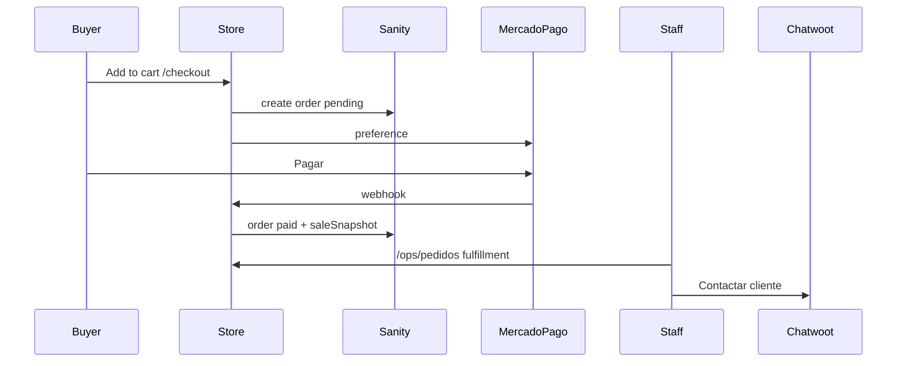

# Playbook — Pedido de punta a punta

Flujo operativo + técnico: carrito → pago → ops → inbox. Usar con skills `sa-commerce` y `sa-ops`.

## Diagrama

## Pasos

### 1. Compra (storefront)

1. Producto comprable según `getProductPurchaseState` (`lib/commerce.ts`).
2. Add to cart → drawer o `/carrito` (snapshot en `sa_cart_v1`).
3. `/checkout` envía items + customer + shipping a `POST /api/checkout`.
4. Server revalida precios/stock; crea `order` `pending` / `to_prepare`; preference MP; redirect `initPoint`.

### 2. Pago

| Retorno UI | Significado |
| --- | --- |
| `/pedido/exito` | Aprobado (limpia carrito en cliente) |
| `/pedido/pendiente` | Pendiente MP |
| `/pedido/fallo` | Rechazado/error |

Fuente de verdad del pago: **webhook** `POST /api/mercadopago/webhook` (no confiar solo en la URL de retorno). Localhost no recibe notificaciones; hace falta URL pública (tunnel/deploy).

Al `approved`: `order.status = paid` + `saleSnapshot` idempotente (`orderId` único, `channel: online`). Si el order ya está `paid`, el webhook no degrada el status (sí puede completar snapshot / `mpPaymentId`).

Mapeo MP (`lib/mercadopago/map-payment-status.ts`): `approved→paid`, `rejected|cancelled→rejected`, `refunded|charged_back→cancelled`; estados intermedios dejan el order en `pending`.

### 3. Ops (staff)

1. Login `/ops/login` (`OPS_PASSWORD`).
2. `/ops/pedidos`: pedidos pagados primero.
3. Avanzar fulfillment: `to_prepare` → `preparing` → `shipped` → `delivered`.
4. Stock online: hoy **manual** en `/ops` productos (no auto al pagar). Offline sí descuenta al registrar venta.
5. Métricas: `/ops/metricas` (lee snapshots online + offline).

### 4. Atención (Chatwoot)

1. Abrir inbox vía `NEXT_PUBLIC_OPS_INBOX_URL`.
2. Desde detalle de pedido: copiar teléfono / “Contactar en inbox” — buscar conversación en Chatwoot.
3. Responder **solo** desde Chatwoot. Fuera de ventana 24h: plantilla Meta.

## Diagnóstico rápido

| Síntoma | Dónde mirar |
| --- | --- |
| Checkout 400 validación | `lib/checkout/validate-cart.ts`, `parse-request.ts` |
| Preference / initPoint falla | `lib/mercadopago/client.ts`, `NEXT_PUBLIC_SITE_URL`, keys MP |
| Pagó pero order sigue pending | Webhook, firma (`verify-signature`), `proxy.ts` (ruta MP excluida del site gate) |
| Pending sin `mpPaymentId` | Webhook no llegó / no procesó |
| Pending con `mpPaymentId` | Status MP no-`approved` (ver `map-payment-status`) |
| Pagó sin métricas | `lib/ops/sale-snapshot.ts`; backfill `npm run backfill:sale-snapshots` |
| No puede marcar shipped | Pedido no `paid`; `lib/ops/orders.ts` |
| Cliente escribe y nadie ve | Chatwoot webhook / `NEXT_PUBLIC_OPS_INBOX_URL` |

## Archivos ancla (debug)

1. `app/api/mercadopago/webhook/route.ts` — ¿llegó? ¿mapeó a paid?
2. `app/api/checkout/route.ts` — ¿pending + preference?
3. `lib/checkout/create-order.ts` — `externalReference`, `notification_url`, `back_urls`
4. `lib/mercadopago/map-payment-status.ts` — por qué quedó pending
5. `lib/ops/orders.ts` (+ doc `order` en Sanity) — `status`, ids MP, `externalReference`

## Checklist humano (no automatizar sin review)

- [ ] No reenviar webhooks de prueba contra producción sin cuidado
- [ ] No mutar `saleSnapshot` históricos
- [ ] No enviar WhatsApp autónomo al cliente
- [ ] Confirmar `unitCost` en productos si el margen importa
